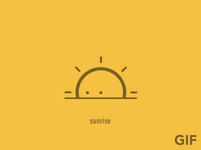
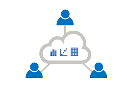

```{r setup, include=FALSE}
knitr::opts_chunk$set(echo = FALSE)
```

# Part 1

## Welcome
<center></center>

## Agenda

- intro to Tercen
- concepts (e.g. measurements, table, computed table)
- loading up data (e.g. csv and tsv)
- creating a Tercen workflow
- visuals (points, heatmaps, line graphs, bar graphs, pairwise)
- visual wrangling
- navigate (in data, in projects)

## Why we started Tercen

- the story

## Challenges

__Biologist's__ challenges:

* Get control of data
* Handle large data sizes
* Reduce analysis time
* Integrate external databases
* Visual Interaction

__Bioinformatician's__ challenges:

* Validate methodologies
* Improve analysis quality
* Educate biologists on statistical techniques
* Reduce time spent on IT support

## Features
* Generate any visual
* Visual computation
* Workflow analysis and customization
* Integrate external knowledge
* Sharing data and analysis
* Results reporting
* Project centric analysis
* Data provenance
* Add operators or apps (i.e. plug-ins)
* Programmatic access (Tercen API)
* Cloud hosted or on-site
* Zero install

<center></center>


## Concepts and terms

- measurement
- variable
- observation
- annotation
- all of the above are called factors
- long format vs wide format
- table
- compute on the table
- computed table

## Wrangling

- visual wrangling
- data wrangling
- computational wrangling

```{r echo = FALSE}

pie(c(80,20), labels=c("Wrangle", "Compute"), main="Where is time spent?", col=c("orange","green"), border="white", clockwise=FALSE)

```

## Let's start

- does everyone have the chrome browser installed?
- how many have a laptop with Windows?
- how many have a laptop with Linux?
- how many have a Mac?
- how many do not have a laptop?
- how many have excel, or libreoffice?

## Let's start

- get tercen
- otherwise use the desktop version
- login

## Create a team

- create a team
- double click on team
- create a project

## Get the data

- get the data
- download the data to your machine
- look at data with excel

## Create data in Tercen 

- go to the project folder
- click on left, see "create data"
- upload the data to Tercen
- you should see the data in your project area

## Create workflow in Tercen

- click on left, see "Create workflow"
- white canvas appears
- right click on graph and "Add step"
- add a Table step
- add a Data step


## Cross-tab zone

- left area are factors in the factor zone
- right area is the graph zone
- drag factors from left to right
- filter zone
- color zone
- label zone
- x-axis zone
- row zone
- column zone
- y-axis zone

## Points

- variables as rows
- observations as column 
- measurement as a y-axis

## Heatmap

- create a heatmap

## Welcome to Tercen
<center></center>

<center>...welcome to Tercen...</center>

## Navigating heatmap

- scrolling rows
- scrolling columns
- squashing/expanding rows
- squashing/expanding columns
- squashing/expanding cell/datapoint

## Bar graphs (sample replicates)
- create a bar graph

## Line graphs (gene profiles)
- create a gene profile

## Pairwise sample plots
- create a sample vs sample

## Save workflow

- save icon on workflow tab
- icon dissappears when saved

## Project Navigation 

To go up:
The top left icon allows you to navigate to up one level

- click on folder icon, to get up to project
- click on people icon, to get up to team

To go down:
- click on project
- click on workflow
- click on data

## Coffee break

<center></center>

# Part 2

## Recap Part 1
- motivation
- table concept
- teams, projects, workflows
- visual wrangling (i.e. projections) using cross-tab

## Agenda Part 2

- computation
- group comparisons (e.g. t-test, anova)
- dimension reduction (e.g. pca, tsne)
- clustering (e.g. hierarchical clustering)
- venn diagrams (e.g. shiny venn)
- using biological database (e.g. protein atlas)
- exporting

## Computation concepts

- table
- variables as rows
- observations as columns
- operator computes
- computed table

## Output relations

- per data point
- per cell
- per row or col
- per table

## Tercen operators

- github operators
- applibrary
- operator help

## Tercen operator examples

- Log (per point)
- Mean (per cell)
- hclust (per row, per col)
- pca (per col)

## Anova-1 way
- row zone put gene_id (i.e. the variable)
- col zone put sample (i.e. the observation)
- data of multi-group into one cell  
- use color to determine

## T-test
- use y-axis for measurement
- data of two groups per cell
- use color to determine two group per cell
- output is p value per cell

## pca dimension reduction
- use color to determine multiple group 
- output is a returned per col

## tsne dimension reduction

```{r results = 'asis'}
data <- data.frame(help=c(1,2), me= c(1,2))
knitr::kable(data, caption = "Table with kable")
```

## Venn diagram

- install shiny venn operator
- add a data step to the t-test
- put pvalues as y-axis
- left tab output of venn

## Export your data

- add an export step to venn
- run
- data is the project 


## Summary

- install operators
- run operators
- view the operator results
- operator relations
- operator examples, t-test, anova
- venn shiny operator
- export

## Afternoon

- one-2-one sessions
- practice
- bring your own data

## Lunch time

<center></center>


